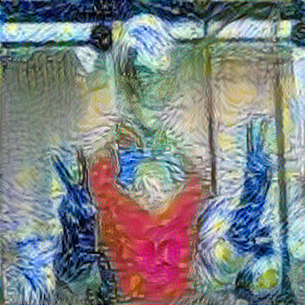

# Neural-Style
# Nama         :  Nizar Fazari Hidayat
# NIM          : 41236824
# Kelas        : TI-2023-REG-P1
# Mata Kuliah  : Deep Learning Lanjut

# 🧠 Neural Style Transfer (NST) — Peacemaker × Starry Night

Proyek ini merupakan implementasi **Neural Style Transfer (NST)** untuk menggabungkan konten dari gambar tokoh Peacemaker dengan gaya visual dari lukisan legendaris **Starry Night** karya Vincent van Gogh. Repositori ini berisi notebook, gambar input, dan output hasil style transfer.

---

## 📁 Struktur Repository

| File                                         | Deskripsi                                                                                                                                                       |
| -------------------------------------------- | --------------------------------------------------------------------------------------------------------------------------------------------------------------- |
| `41236824_tugas_Neural_Style_Transfer.ipynb` | Notebook utama yang berisi seluruh proses NST: load gambar, preprocessing, ekstraksi fitur, perhitungan content & style loss, hingga menghasilkan output final. |
| `Peacemaker.jpg`                             | Gambar konten yang dipertahankan bentuknya dalam proses NST.                                                                                                    |
| `neural style.jfif`                          | Gambar gaya (Starry Night) yang digunakan untuk mentransfer pola brushstroke dan warna.                                                                         |
| `Peacemaker_Styled.png`                      | Hasil akhir style transfer yang sudah diproses dari konten Peacemaker ke gaya Starry Night.                                                                     |

---

## 🧩 Penjelasan Proses Neural Style Transfer

Implementasi NST di notebook mengikuti alur sebagai berikut:

### **1. Load Library dan Persiapan Lingkungan**

Notebook menggunakan library seperti:

* TensorFlow / PyTorch
* NumPy
* Matplotlib
* PIL (Pillow)

### **2. Load dan Preprocessing Gambar**

Notebook memuat dua gambar penting:

* **Content Image**: Peacemaker
* **Style Image**: Starry Night

Langkah preprocessing meliputi:

* Resize gambar
* Normalisasi pixel
* Konversi ke tensor
* Penambahan batch dimension

### **3. Exploratory Data Analysis (EDA)**

EDA singkat mencakup:

* Menampilkan kedua gambar
* Melihat dimensi dan format gambar
* Analisis singkat mengapa kedua gambar cocok untuk eksperimen NST

### **4. Load Model Feature Extractor (VGG19)**

Model **VGG19 pre-trained ImageNet** dipakai sebagai *feature extractor*.
Layer yang digunakan:

* Layer untuk **Content Representation**
* Layer untuk **Style Representation**

### **5. Perhitungan Loss Function**

Notebook menghitung:

* **Content Loss**: menjaga struktur objek Peacemaker
* **Style Loss**: menggunakan *Gram Matrix* untuk mentransfer tekstur dan pola Starry Night
* **Total Loss = α * Content Loss + β * Style Loss**

### **6. Optimasi dan Training Loop**

Menggunakan optimizer seperti **Adam** atau **LBFGS** untuk memperbarui pixel pada output image hingga menyerupai gaya Starry Night.

### **7. Output Akhir**

Notebook menghasilkan:

* **Peacemaker_Styled.png**, yaitu gambar Peacemaker dengan nuansa warna dan tekstur seperti karya Van Gogh.

---

## 🎨 Visualisasi Hasil

### **Input & Output**

### **Output**

| Hasil Style Transfer       |
| -------------------------- |
|  |

---

## 🚀 Teknologi yang Digunakan

* Python
* TensorFlow / PyTorch
* VGG19 Pretrained
* Matplotlib
* NumPy
* PIL (Pillow)

---

## 📄 Cara Menjalankan Notebook

1. Upload semua file ke Google Colab atau jalankan secara lokal.
2. Pastikan seluruh dependency sudah terpasang.
3. Jalankan notebook dari atas ke bawah.
4. Hasil akhir otomatis tersimpan sebagai **Peacemaker_Styled.png**.

---

## 📝 Catatan

Proyek ini dibuat untuk keperluan pembelajaran dalam memahami konsep Neural Style Transfer dan eksperimen pengolahan citra menggunakan Deep Learning.
---

